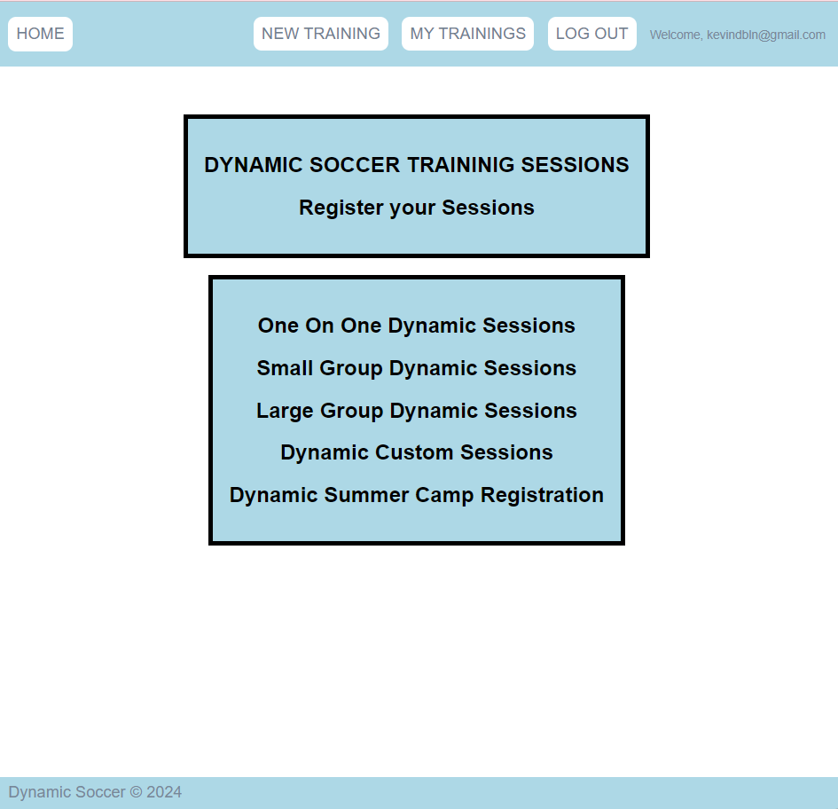

# Dynamic Soccer
https://dynamicsoccer-814ac914ad58.herokuapp.com/

## Coaches Application that allows them to Create | Update | Delete training sessions.

Dynamic Soccer application allows for Football Coaches (soccer) the ability to create their own account and input training sessions in their account. The coach will have the ability to delete any training sessions they have entered into their account as well as update.

* Create their own Dynamic Training Sessions
* Update their Dynamic Training Sessions
* Delete their Dynamic Training Sessions
* Quickly provide what these sessions will cost per hour at a glance
* Ability to quickly get your specific availability to train to the masses

### Project Resource Continuity Guide:
https://trello.com/b/hLlIDS5s/dynamic-soccer-training

## Technology
* VS Code
* GitHub
* Heroku
* Trello
* HTML
* JavaScript
* CSS

### Landing Page:

### My Training Page:

### Edit or Delete Session Page:

# Icebox
## Inserting my logo

### More Functionality and users to be added
1. AAC, Landing Page give a quick sessions view | Log-In | Sign-Up
2. AAC, View All Coaches and their sessions with details
3. AAC, Book Sessions (Specific Coach | One of the coaches Training Type)
4. AAC, after booking, you will go to a page that lists out all your bookings
5. AAC, You will now have the option to delete your booked sessions or leave a note in that sessionsfor the coach.

# Vital Contributions:
## 1. Reed Krosby
## 2. DeShae B
## 3. Miriam Aviles
## 4. The Cave
## 5. Sam Bassong
## 6. Jim Clark
=> Thank you for your patience | Knowldege and PATIENCE!!